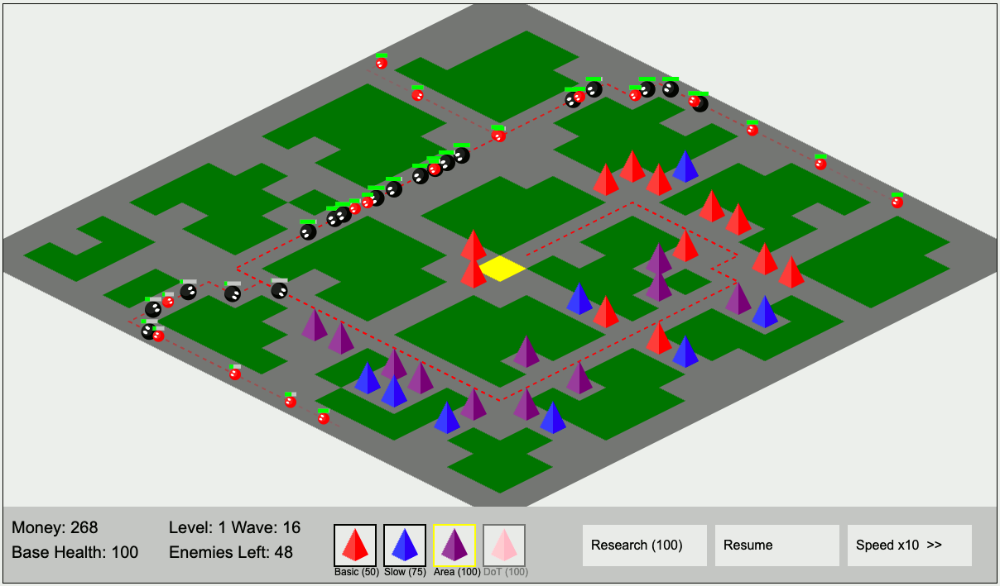

# Tiny Tower Defense

A browser-based tower defense game with an isometric city grid, featuring multiple tower and enemy types, strategic placement, and dynamic pathfinding. No external dependencies are required - just open `index.html` in a modern web browser to play.

## Features
- **Isometric Grid**: 20x20 city layout with streets, buildings, parking lots, and a central base.
- **Towers**: Four types: Direct damage, slowing enemies, area damage, or damage-over-time.
- **Enemies**: Three types (Basic, Fast, Tank) with varying health, speed, and rewards.
- **Game Mechanics**:
  - Place towers strategically to block enemy paths to the base.
  - Earn money by defeating enemies to buy or upgrade towers.
  - Research new tower types.
  - Pause/resume or speed up gameplay.
- **Pathfinding**: Enemies dynamically navigate to the base, adjusting paths when towers are placed or removed.
- **Win/Lose Conditions**:
  - Win: Complete 25 waves in a level.
  - Lose: Base health reaches zero.

## Screenshot

## Setup and Play

### Run Locally
1. Clone or download the repository: `git clone https://github.com/dmatscheko/tower_defense.git`.
2. To enable sound effects, serve the files with a web server (e.g., `python3 -m http.server 8000` in the directory containing `index.html`).
3. Open `http://localhost:8000/` in a modern browser (Chrome, Firefox, Edge).
4. Alternatively, open `index.html` directly, but sound effects may not load due to browser security restrictions.

### Controls
- **Left-click**: Select towers from the UI, place towers on valid tiles (streets/parking lots), or interact with buttons (Research, Pause, Speed).
- **Right-click**: Remove a placed tower (refunds half the cost).
- **Mouse hover**: Display tower range.

### Objective
Prevent enemies from reaching the base by placing towers strategically. Manage resources to survive all waves.

Enjoy defending the city!